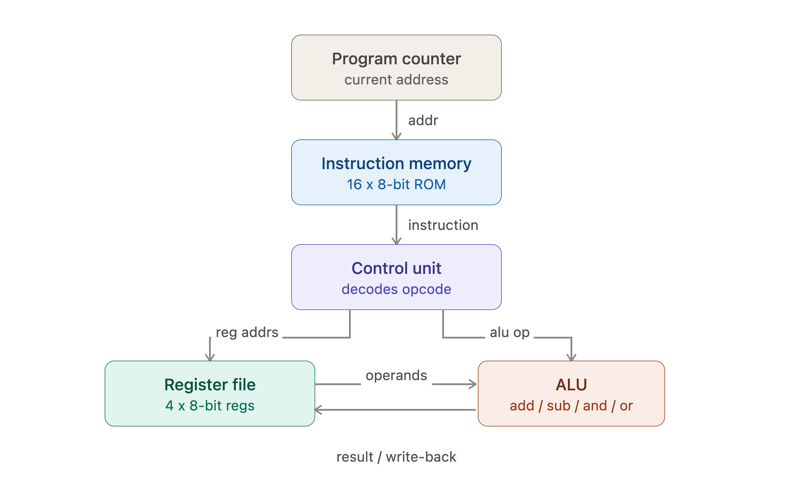
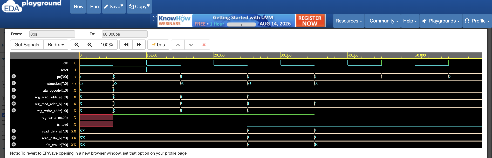
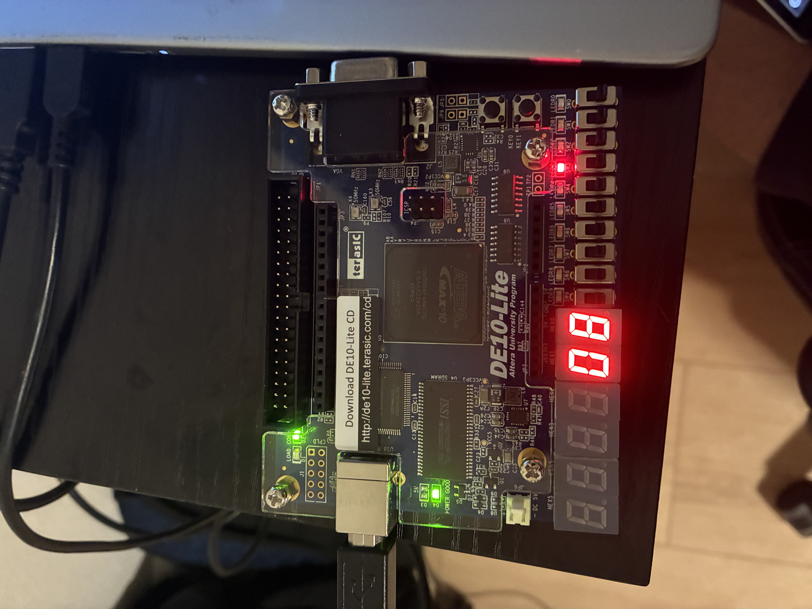
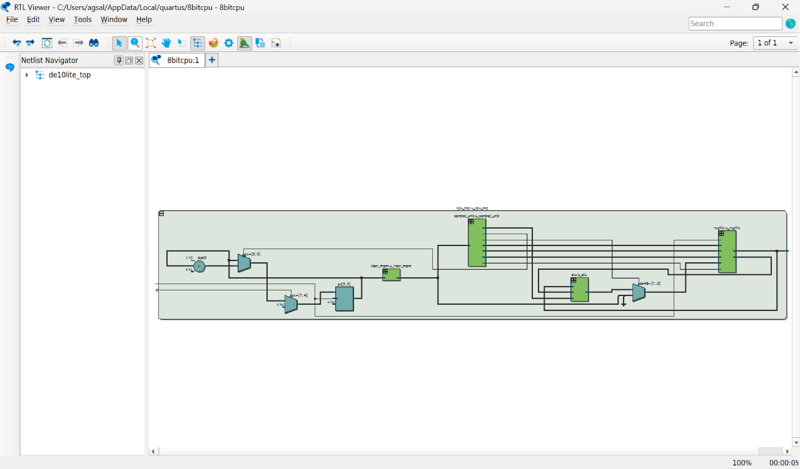
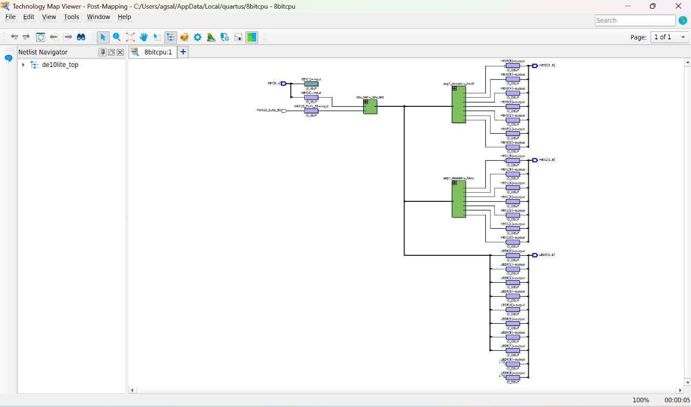

# 8-Bit CPU in Verilog

### A custom 8-bit single-cycle CPU designed from scratch in Verilog, synthesized and verified on an Intel DE10-Lite FPGA (MAX 10) using Quartus Prime.

  

### Overview

This project implements a complete 8-bit processor: ALU, register file, instruction memory, and control unit, each built up module by module, each independently simulated and verified before integration. It was built to gain hands-on understanding of digital logic design, Verilog, and FPGA deployment, going from individual combinational/sequential circuits through a working fetch-decode-execute system running on real hardware.

### Architecture

  

The CPU uses a single-cycle architecture where every instruction completes fetch, decode, execute, and write-back within one clock cycle. The program counter drives the instruction memory, the control unit decodes each fetched instruction into ALU and register-file control signals, and the register file and ALU exchange operands and results each cycle.

### Instruction Set Architecture

8-bit instruction format: [opcode: 3 bits] [reg: 2 bits] [reg2/immediate: 3 bits]

This is a 2-address format with the destination register doubling as one of the two operands (ex., ADD R0, R1 means R0 <= R0 + R1), which lets a full instruction (opcode + two operand references) fit in 8 bits.

| Opcode | Mnemonic | Format | Description |
| :--- | :--- | :--- | :--- |
| `000` | **HALT/NOP** | - | No operation, PC freezes |
| `001` | **ADD** | `ADD Rd, Rs` | $Rd \leftarrow Rd + Rs$ |
| `010` | **SUB** | `SUB Rd, Rs` | $Rd \leftarrow Rd - Rs$ |
| `011` | **AND** | `AND Rd, Rs` | $Rd \leftarrow Rd ~\&~ Rs$ |
| `100` | **OR** | `OR Rd, Rs` | $Rd \leftarrow Rd \mid Rs$ |
| `101` | **LOAD** | `LOAD Rd, #imm` | $Rd \leftarrow \text{immediate}$ |
| `110/111` | *(reserved)* | - | No operation (safe default) |

### Features
• Single-cycle fetch-decode-execute architecture
• 4 general 8-bit registers (R0-R3)
• 16-word instruction memory (ROM)
• Dual-port combinational register reads, gated synchronous writes
• ALU supporting ADD/SUB/AND/OR with zero and carry-out flags
• Real-time output on physical LEDs and 7-segment hex displays
• Every module independently verified with a self-checking testbench

### Bugs Found and Fixed

Opcode-0 Aliasing: In the original instruction encoding, opcode 000 meant LOAD. Verilog memory defaults to all zeros when not explicitly initialized, and unused instruction memory slots were explicitly set to 8'b000_00_000 as a safe placeholder. Since the program counter never stops incrementing on its own, it eventually walks into this unused memory, and 000_00_000 is decoded as a real, valid instruction: LOAD R0, #0, silently overwriting a correct result of 8 back down to 0.

Fix: reserved opcode 000 specifically as HALT/NOP (no register write occurs), and moved LOAD to opcode 101. Any unset or unreachable memory now defaults to something genuinely harmless, rather than accidentally executing a real instruction. This is the same defensive design principle real ISAs use in reserving opcode 0 for a safe no-op.

PC free-running past HALT: After fixing the above, the design still had another issue: HALT only disabled register writes so it never stopped the program counter itself. This meant the CPU looped its 3-instruction program forever at 50MHz, and the displayed register value flickered faintly (a visible light on LEDR0) as the program re-executed its LOAD instructions at every wraparound.

Fix: added an is_halt signal from the control unit and gated the program counter's increment on it, so the PC genuinely freezes once HALT is reached, producing a clean, steady, flicker-free result.

### How to Simulate

Each module has an independent, self-checking testbench (Icarus Verilog):

#ALU
iverilog -o alu_sim rtl/alu.v sim/alu_tb.v && vvp alu_sim

#Register file
iverilog -o regfile_sim rtl/regfile.v sim/regfile_tb.v && vvp regfile_sim

#Instruction memory
iverilog -o instr_mem_sim rtl/instr_mem.v sim/instr_mem_tb.v && vvp instr_mem_sim

#Control unit
iverilog -o control_unit_sim rtl/control_unit.v sim/control_unit_tb.v && vvp control_unit_sim

#Full CPU integration
iverilog -o cpu_top_sim rtl/alu.v rtl/regfile.v rtl/instr_mem.v \
  rtl/control_unit.v rtl/cpu_top.v sim/cpu_top_tb.v && vvp cpu_top_sim

### Simulation Waveform

  

Waveform showing the CPU executing its test program: the program counter steps through addresses 0-4, fetching LOAD R0,#5 -> LOAD R1,#3 -> ADD R0,R1 -> HALT. read_data_a transitions 0 -> 5 -> 8, confirming correct execution and register write-back.

### Test Results

PASS [ADD]: a=10 b=20 opcode=0 -> result=30
PASS [SUB]: a=30 b=10 opcode=1 -> result=20
PASS [AND]: a=170 b=204 opcode=10 -> result=136
PASS [OR]: a=170 b=204 opcode=11 -> result=238
PASS [ZERO FLAG]: zero correctly high on result=0
PASS [CARRY OUT]: carry_out correctly high on overflow

ALL TESTS PASSED
PASS: R0 = 8 (expected 8, from 5+3)
R1 = 3 (expected 3)

Full-system testbench additionally runs 2 extra clock cycles past the program's end, into unused instruction memory, to confirm the HALT/NOP safety fix holds under real operating conditions; R0 correctly stays at 8 rather than being corrupted.

### Hardware Instructions

• Quartus Prime, new project, device family MAX 10, part 10M50DAF484C7G
• Add all files from rtl/ to the project
• Set de10lite_top as the top-level entity
• Import the official Terasic DE10_LITE.qsf pin assignment file
• Processing -> Start Compilation
• Tools -> Programmer -> Start; load onto the board

### Hardware Demo

  

Pressing and holding KEY0 keeps the CPU in reset, continuously reloading R0 with 5. Releasing it runs the full program to completion: R0 becomes 5+3=8, shown in hex on HEX0/HEX1 ("08") and in binary on the LEDs (LEDR3 lit alone), holding steady with no flicker.

### Hardware Schematics

  

RTL schematic (Quartus RTL Viewer), auto-generated directly from the Verilog source, showing the synthesized module hierarchy and interconnects.

  

Post-synthesis gate-level view (Technology Map Viewer), showing the design mapped onto the DE10-Lite's actual MAX 10 logic elements.

### Future Work

Planned extension: a low-cost FPGA-based pulse/heart-rate monitor, using a photoplethysmography (PPG) sensor feeding into the DE10-Lite's onboard ADC, with peak detection and BPM calculation implemented as a hardware extension to this CPU's instruction set.

### Tools and Resources

• Quartus Prime (Intel FPGA design software)
• Icarus Verilog (open-source simulator)
• HDLBits - Verilog practice exercises
• Ben Eater's "Building an 8-bit CPU" (YouTube) - architectural reference
• Terasic DE10-Lite documentation
